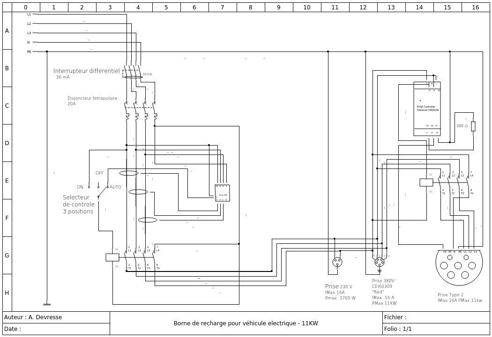

# DIY: Electric Vehicle Charging Station

## WARNING

**Electricity can kill**. Only use this project if you have the necessary knowhow.  Advanced knowledge of low-voltage electricity (220V) and experience in wiring is required. Please also respect the legsilation of your own country.
I am not liable for any material and/or physical damage that may be associated with an implementation of anything describe in this repository

## Description

This project freely documents the wiring diagram and the components necessary to build an **electric vehicle charging station** for vehicles supporting charging via **Type 2 plug**.

Optionally, the station also provides the possibility to charge via **standard plug (Type E/F)** or **three-phase "Red" plug**.

Features:
- Charging power up to 11KW in three-phase (380V)
- Real-time measurement of power and energy consumption per phase
- Support for off-peak hours system via time programming
- Support for remote control via multi-platform WiFi (Web (Linux/Windows) / Android / iPhone)
- Possible home automation integration with MQTT support
- Differential protection in case of current leakage
- Magneto-thermal protection in case of overload
- Support for manual control and emergency stop

The installation should be compatible with any electric or plug-in hybrid vehicle equipped with a Type 2 plug.

This station has been tested (Type 2 plug) with the following vehicles:
- Tesla Model 3 (BEV)
- Mercedes A250 e (PHEV)
- Hyundai Ioniq 5

## Diagram

## Components List

## License

Creative Commons Attribution-ShareAlike 4.0 International (CC BY-SA 4.0) [LICENSE](https://creativecommons.org/licenses/by-sa/4.0/deed.en)
