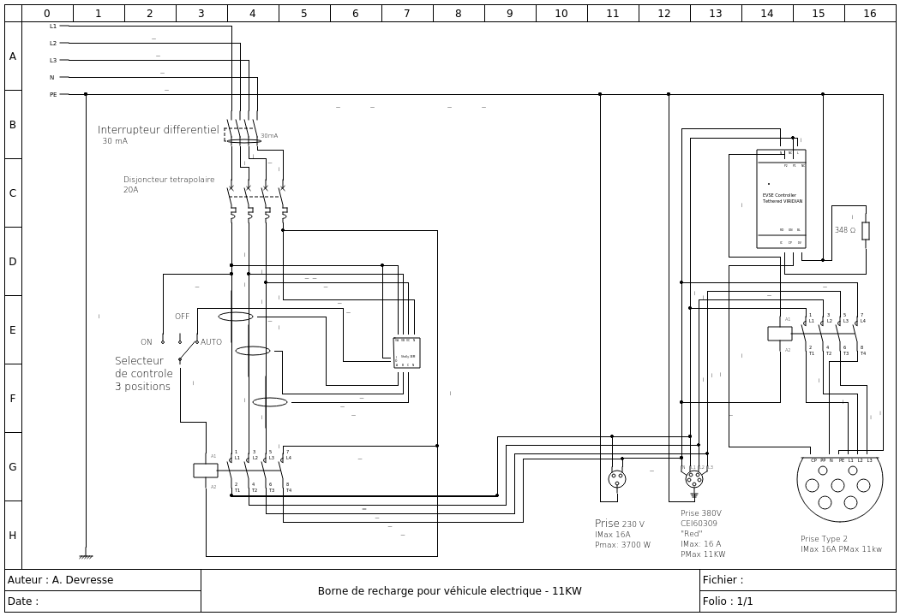

# DIY: Borne de recharge pour véhicule electrique

## ATTENTION

 **L'electricité tue**. Ne faites ce montage UNIQUEMENT si vous avez des connaissances nécessaires. C'est à dire: un niveau avancé en electricité BT ( 220V) et de l'expérience en cablage.
Je me dédouane de tout dommage materiel et/ou corporel qui pourrait être associé à une implémentation.

## Description

Ce projet documente librement le schéma de cablage et les composants nécessaires à la réalisation d'une **borne de recharge pour véhicule electrique** pour véhicule supportant la recharge via **prise Type 2**. 

En Option, La borne fournit également la possibilité de recharger via **prise classique (Prise type E/F)** ou **prise triphasée "Rouge"**.

Liste des fonctionalités
- Puissance de recharge jusqu'a 11KW en triphasé (380V)
- Mesure de la Puissance et de l'energie consommée par phase en temps réel.
- Support pour système Heure Creuses via programmation horaire
- Support  pour commande à distance via Wifi  multiplateforme ( Web (Linux/Windows) / Android / IPhone )
- Possible integration domotique avec support MQTT
- Protection différentielle en cas de fuite de courant
- Protection Magnéto-thermique en cas de surcharge
- Support pour commande manuelle et arrêt d'urgence

L'installation devrait être compatible avec tout véhicule electrique ou hybride rechargeable équipée d'une prise Type 2. 

Cette borne a été testée (Prise T2) avec les véhicules suivants
- Tesla Model 3 (BEV)
- Mercedes A250 e (PHEV)
- Hyundai Ioniq 5 (BEV)

## Schema

## Liste des composants

## License

Creative Common Attribution-ShareAlike 4.0 International (CC BY-SA 4.0)  [LICENSE](https://creativecommons.org/licenses/by-sa/4.0/deed.en)

